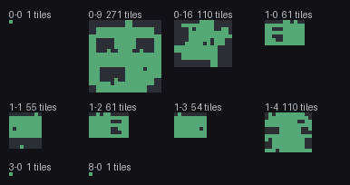
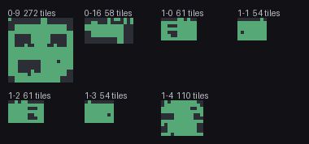

# Pokemon Emerald RL

A reinforcement learning agent that learns to play Pokemon Emerald from pixels, aiming for the first gym badge.

PPO over a Gymnasium environment wrapping mGBA. The agent sees the screen and a small decoded state vector, presses buttons, and is rewarded for exploring Hoenn and making story progress. No scripted routes, no hardcoded paths.

## Exploration spreading over training

Every map the agent has walked, one panel per map, sized to the bounding box of tiles it actually stood on.

| 250k steps | 1.25M steps |
| --- | --- |
|  |  |

Littleroot Town (panel `0-9`) fills in first, then Route 101 (`0-16`), the houses, and Birch's lab (`1-4`) where the starter is obtained. The same image is logged to TensorBoard as `coverage/map`, so it fills in live while training runs.

## What the agent actually achieved

Read any progress savestate with `stats.py`:

```
$ python stats.py
savestate                      where                badges party  seen caught   money
furthest_1maps_0_9.state       Littleroot Town           0     0     0      0    3000
furthest_5maps_0_16.state      Route 101                 0     0     0      0    3000
furthest_6maps_1_4.state       Birch's lab               0     1     2      1    3000

furthest_6maps_1_4.state  at Birch's lab (6, 5)
    mudkip       lv5   20/20 HP
```

It reaches Birch's lab and obtains Mudkip, which requires completing the bag scene, a sequence of dialogue and a scripted battle. No badge yet.

## How it works

**Observation.** Three stacked grayscale frames downscaled to 120x80, plus a 17-value vector decoded from RAM: badge bits, party HP fraction, mean party level, map id, player x/y, money, Pokedex seen and caught.

**Actions.** `Discrete(8)` — no-op, up, down, left, right, A, B, start. One button per step, held 23 of 24 frames after a one-frame release. That release matters: Gen-3 gates dialogue, menus and battle moves on a fresh press edge, so a held button reads as a single press no matter how long it is held.

**Vision.** By default a small CNN trained from scratch (NatureCNN), which is the
standard choice for pixel-based RL. `--backbone resnet18` swaps in a frozen
ImageNet ResNet18 instead, for comparison. Two caveats worth knowing: the three
screen channels are consecutive frames rather than RGB, so ResNet's pretrained
colour filters are being fed temporal structure; and ImageNet is photographs
while Emerald is flat-shaded pixel art. Measured cost is roughly 15% throughput
(266-312 fps against 300-330). Whether it actually helps is an open question the
flag exists to answer.

**Reward.** The badge is roughly 50,000 steps from the start, so a sparse signal cannot bridge the gap. Progress events are combined with a coordinate-novelty bonus:

| Event | Reward |
| --- | --- |
| Gym badge | +100 |
| New map entered | +2 |
| New tile visited | +0.05, capped at 400/map |
| Script event flag set | +1 |
| Trainer defeated | +2 |
| Party level gained | +0.2 |
| Pokemon seen / caught | +0.1 / +0.5 |
| Whiteout | -5, ends episode |
| 5,000 steps earning nothing | -1 |

The per-map tile cap stops the agent farming reward by pacing across a large route.

**Episodes** start from a savestate captured after the intro and end on a badge, a whiteout, or 16,384 steps.

## Layout

| File | Role |
| --- | --- |
| `state.py` | RAM-only game state reader, kept off ROM for speed |
| `env.py` | Gymnasium environment, observations, reward |
| `train.py` | PPO across 8 subprocess workers |
| `backbone.py` | Optional pretrained ResNet18 feature extractor |
| `coverage.py` | Renders the exploration overlay |
| `stats.py` | Decodes a savestate into readable progress |
| `baseline.py` | Random-agent exploration gate |
| `watch.py` | Renders a trained checkpoint playing |
| `make_savestate.py` | One-off tool to capture the starting savestate |

## Running it

Needs a legally-dumped Pokemon Emerald ROM at the repo root as `Pokemon - Emerald Version (USA, Europe).gba`. Not included.

```bash
sudo apt install libmgba0.10t64          # the mgba wheel does not bundle libmgba.so
uv venv --python 3.11 .venv              # 3.11 exactly; mgba has no 3.12 wheels
VIRTUAL_ENV=.venv uv pip install pygba pillow stable-baselines3 tensorboard

python make_savestate.py                 # play the intro once, press S
python train.py --steps 50000000
python train.py --steps 50000000 --backbone resnet18   # pretrained vision instead
python watch.py checkpoints/emerald_final.zip
python stats.py
tensorboard --logdir runs
```

Measured at ~300-330 env steps/sec across 8 workers on an 8-core laptop.

## Things that cost real time

Recorded because none were obvious and each burned hours:

**`import torch` breaks libmgba.** Any emulator core created after torch is imported hangs forever inside `run_frame()`, spinning at 100% CPU. Not SB3, not OpenMP, not `LD_PRELOAD` ordering — torch alone. Both entry points create a throwaway core *before* importing torch, and `SubprocVecEnv` passes `start_method="fork"` because the `forkserver` default forks from a clean process that never saw that warmup.

**Save blocks relocate during map transitions** and parse as garbage for a step or two: bogus map ids, and the event-flag array read at a shifted offset. Before this was caught, walking through a doorway paid up to **+177** against a +100 badge. Reward, termination and coverage all now gate on the map id being stable.

That garbage also has a second bite. Player coordinates are `uint16`, so a bad read yields up to 65535. One bad x and one bad y on the same map made the coverage renderer size a bounding box at 65528x65526 and allocate **12.9GB**, and the kernel OOM-killed training twice before it was found.

**Held buttons never register as repeat presses.** Two consecutive A actions were one continuous hold, so every mandatory dialogue and battle sequence was mechanically unreachable. Measured: 300 steps of held-A stays stuck on the title screen; pulsed-A reaches the intro's end.

**Map ids are not ordered by route progress.** Rustboro is `(0,3)`, behind Littleroot's `(0,9)`. Tracking "furthest map" by tuple comparison silently pinned after the first route.

## Known limits

- The effective value horizon is about 1,000 steps against a 16,384-step episode. The reward is dense by design, so the agent follows a local gradient rather than seeing the badge from the start.
- The exploration bonus is not Markovian with respect to the observation, and its sets reset each episode, so re-running a known route pays again.
- Coverage panels are bounding boxes of where the agent has been, not true map dimensions. The map header holding width and height is not exposed by the bindings.
- A checkpoint curriculum is the documented fallback if training plateaus; `train.py` emits the savestates it would need.

Design and implementation notes are in `docs/superpowers/`.
